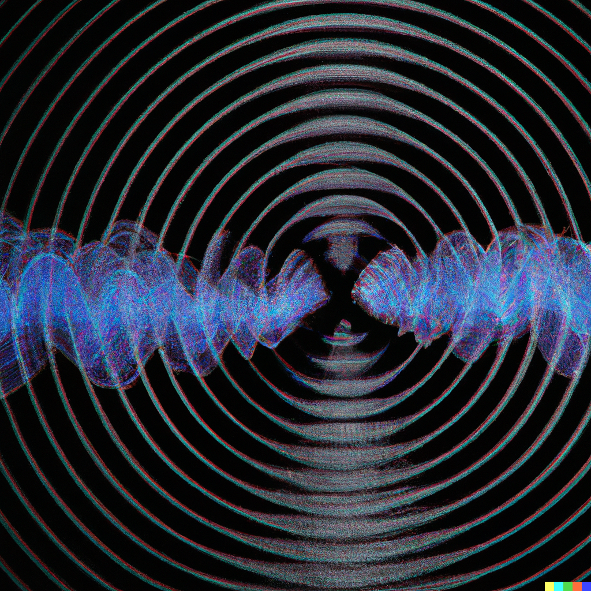

# Incus
## Acoustic FDTD Simulator
Acoustic Simulator for Python

    pip install incus
    
### 
 
    
### Tree   
<pre>
|----Continuum(object)----|
|                         |---__init__(grid_size,ds)
|                         |---add(arg)
|                         |---export_grid()
|                         |---build(verbose=1)
|                         |---impose_grid(c,rho)
|                         |---view_structure(field="c",*args,colorbar=True)
|                         |---view_field(field="P",*args,colorbar=True)
|                         |---Render(time_steps,backend="numpy",observers=None)
|
|
|
|----DotSource(object)----|
|                         |---__init__(location,presence,amplitude,frequency,phase=0)
|                         |---__repr__()
|                         |---set_dt(dt)
|                         |---inf()
|                         |---dimensionality()
|                         |---location()
|                         |---__call__(t)
|
|
|
|---geo(module)-----------|----PointCloud(object)-------|
                          |                             |---__init__(points,layer=0,c=331.29,rho=1.225,time=None)
                          |
                          |
                          |----Rectangle(PointCloud)----|
                          |                             |---__init__(A,B,layer=0,c=331.29,rho=1.225,time=None)
                          |
                          |
                          |----RectPrism(PointCloud)----|
                          |                             |---__init__(A,B,layer=0,c=331.29,rho=1.225,time=None)
                          |
                          |
                          |----Circle(object)-----------|
                          |
                          |
                          |----Sphere(object)-----------|
                          |                             |---__init__(A,r,layer=0,c=331.29,rho=1.225,time=None)
                          |
                          |
                          |----Cylinder(object)---------|
                                                        |---__init__(A,r,h,layer=0,c=331.29,rho=1.225,time=None)

</pre>

  # Documentation
  

  
  ## Continuum(dim,grid_size,ds)
   Creates a fluid field with given dimensions and grid size. Grid spacing is introduced with ds.
   - **grid_size** : Defines grid cell count per axis. It may take a tuple or list. It's 2D or 3D.
   - **ds** : Length of a edge of a grid cell. It may take a float or integer. **All units are SI**.

### add(arg)
  Adds either new geometries, celestial objects and sources into the Continuum.
  - **arg** : It adds new objects into the grid. It can take either defined object or list/tuple of them(recursively). It can take tuple, list, set, everything in **geo**(**geo.\***) and **DotSource**. As long as dimensionality of object and Continuum is the same, it is added.
### build(verbose=1)
   Builds the structure. 
   - **verbose**: Determines whether info is displayed. If 0, nothing displayed. If 1, render time is displayed.
### export_field()
  Get Pressure and Velocity Field arrays. It returns a tuple (P, v).
### export_grid()
  Get speed of sound and denisty arrays. It returns a tuple (c, rho).
### impose_grid(c,rho,anisotropy=(False,False))
  Embed the the grid - generated by other sources -. It is useful for fetching material structure from any optimization algorithm and examining it's acoustic properties with **incus**.
  - **c**: Speed of sound of each point of the grid. Shape of the array is (Nx, Ny,...). The unit is **m/s**
  - **rho**: Density of each point of the grid. Shape of the array is (Nx, Ny,...). The unit is **kg/m^3
### view_structure(field="c",\*args,colorbar=True)
  You can view the grid structure
  - **field** : It takes "c" for speed of sound array, "rho" for density array and "Z" for impedance of the grid.
  - **\*args** : Only used in 3D. It used specify axis of view. Plane and and index number can be inserted. For example "z", 10 corresponds z=10 plane in the 3D array. "x","y","z" can be inserted. Also "yz", "xz", "xy" are synonym respectively.
  - **colorbar**: If is is set to **True**, colorbar is displayed.
### view_field(field="P",*args,colorbar=True)
  You can get graph of Pressure or Velocity Field.
  - **field** : It takes "P" for pressure field, "v" or velocity field.
  - **\*args** : Only used in 3D. It used specify axis of view. Plane and and index number can be inserted. For example "z", 10 corresponds z=10 plane in the 3D array. "x","y","z" can be inserted. Also "yz", "xz", "xy" are synonym respectively.
  - **colorbar**: If is is set to **True**, colorbar is displayed.
### Render(time_steps,backend="numpy",observers=None)
   Executes FDTD calculations on a Continuum object.
   - **time_steps** : It is number of time steps that field will evolve. It may take an integer. Lenght of time steps is given by ds/c/(&#8730;dim) ; where ds is grid spacing, c is max speed of sound in the grid(331.29 default) and dim is number of dimensions of the grid. All units are SI.
   - **backend** : It sets the backend. Only **numpy** is supported recently. Therefore it is always **numpy**
   - **observers** : Determines whether time dependent logging will be the case. If it is set to <code>None</code>, time dependent observation is not the case. However, it is a tuple or list of points e.g <code>[ (0,0), (2,2) ]</code> then it returns Pressure-field amplitude of each given point. Returned array's order is the same as implicit order of the fed list/tuple.

 

  ## DotSource(location,presence,amplitude,frequency,phase=0)
   Creates a point source on a given place on grid, through given time interval with given amplitude, frequency and phase.
   - **location** : It is location of dot source. It may take a list or tuple. 
   - **presence** : It is a tuple or list in the form of:( start, stop ). It defines in which time step dot source emits electromagnetic wave.
   - **amplitude** : Amplitude of the wave. It may take int or float.
   - **frequency** : Frequency of the wave. It may take int or float.
   - **phase** : Phase of the wave. It may take int or float. It is default 0.
 
  ## geo.PointCloud(points,layer=0,c=331.29,rho=1.225,time=None)
  Creates a point cloud object in 2D or 3D. It infills inside the points. It is compatible with convex hull. Draw miscallenious objects(i.e. hexagon,star, hearth) with it. 
  - **points** : Points that defines convex full. It is a list, tuple or array of 2D or 3D points. Coordinates indicates # of cell in the grid. Like [(1,2), (2,3), (3,4)]. I needs at least 3 points in 2D, 4 points in 3D. 
  - **layer** : Priority of the object. It is an integer. The less **layer** value, the more prior the object. It is useful where you want to design object are overlapping like open access cavity dielectric waveguides.
  - **c** : Speed of sound of the object(**m/s**). It may take float ot int. It is not restricted to be less than 1 intentionally, for researching Cherenkov Radiation, metamaterials etc.
  - **rho** : Density of the object(**kg/m^3**). It may take float ot int. It is not restricted to be less than 1 intentionally.
  - **time** : It determines in which time the object is seen and dissappear. If the object is eternal, <code>time=None</code>; otherwise <code>time=(start, stop)</code>, it is a list/tuple of start and stop durations
  
  
  ## geo.Rectangle(A, B, layer, c=331.29, rho=1.225, time=None)
  Creates a rectangle in 2D.
  - **A**: One of non-connected vertex of the Rectangle. It may take an integer. All units are # of grid cells.
  - **B**: One of non-connected vertex of the Rectangle. It may take an integer. All units are # of grid cells.
  - **layer** : Priority of the object. It is an integer and maximum can take 1000. The less **layer** value, the more prior the object. It is useful where you want to design object are overlapping like open access cavity dielectric waveguides.
  - **c** : Speed of sound of the object(**m/s**). It may take float ot int. It is not restricted to be less than 1 intentionally, for researching Cherenkov Radiation, metamaterials etc.
  - **rho** : Density of the object(**kg/m^3**). It may take float ot int. It is not restricted to be less than 1 intentionally.
  - **time** : It determines in which time the object is seen and dissappear. If the object is eternal, <code>time=None</code>; otherwise <code>time=(start, stop)</code>, it is a list/tuple of start and stop durations
  
  ## geo.Circle(A,r,layer,c=331.29, rho=1.225, time=None)
  Creates a circle in 2D.
  - **A** : Coordinates of center of the Circle. It may take a tuple or list. All units are # of grid cells.
  - **r** : Radius of the circle. It may take an integer. All units are # of grid cells.
  - **layer** : Priority of the object. It is an integer and maximum can take 1000. The less **layer** value, the more prior the object. It is useful where you want to design object are overlapping like open access cavity dielectric waveguides.
   - **c** : Speed of sound of the object(**m/s**). It may take float ot int. It is not restricted to be less than 1 intentionally, for researching Cherenkov Radiation, metamaterials etc.
  - **rho** : Density of the object(**kg/m^3**). It may take float ot int. It is not restricted to be less than 1 intentionally.
  - **time** : It determines in which time the object is seen and dissappear. If the object is eternal, <code>time=None</code>; otherwise <code>time=(start, stop)</code>, it is a list/tuple of start and stop durations

  ## geo.RectPrism(A, B, layer, c=331.29, rho=1.225, time=None)
 Creates a rectangular prism in 3D.
  - **A**: One of non-connected vertex of the RectPrism. It may take an integer. All units are # of grid cells.
  - **B**: One of non-connected vertex of the RectPrism. It may take an integer. All units are # of grid cells.
  - **layer** : Priority of the object. It is an integer and maximum can take 1000. The less **layer** value, the more prior the object. It is useful where you want to design object are overlapping like open access cavity dielectric waveguides.
  - **c** : Speed of sound of the object(**m/s**). It may take float ot int. It is not restricted to be less than 1 intentionally, for researching Cherenkov Radiation, metamaterials etc.
  - **rho** : Density of the object(**kg/m^3**). It may take float ot int. It is not restricted to be less than 1 intentionally.
  - **time** : It determines in which time the object is seen and dissappear. If the object is eternal, <code>time=None</code>; otherwise <code>time=(start, stop)</code>, it is a list/tuple of start and stop durations
  
  ## geo.Sphere(C,r,layer=0,c=331.29, rho=1.225, time=None)
  Creates a sphere in 3D.
  - **C** : Coordinates of center of the Sphere. It may take a tuple or list. All units are # of grid cells.
  - **r** : Radius of the sphere. It may take an integer. All units are # of grid cells.
  - **layer** : Priority of the object. It is an integer and maximum can take 1000. The less **layer** value, the more prior the object. It is useful where you want to design object are overlapping like open access cavity dielectric waveguides.
  - **c** : Speed of sound of the object(**m/s**). It may take float ot int. It is not restricted to be less than 1 intentionally, for researching Cherenkov Radiation, metamaterials etc.
  - **rho** : Density of the object(**kg/m^3**). It may take float ot int. It is not restricted to be less than 1 intentionally.
  - **time** : It determines in which time the object is seen and dissappear. If the object is eternal, <code>time=None</code>; otherwise <code>time=(start, stop)</code>, it is a list/tuple of start and stop durations
  
  ## geo.Cylinder(C,r,h,layer=0,c=331.29, rho=1.225, time=None)
 Creates a cylinder in 3D. Its planes are **parallel to xy-plane**
  - **C** : Coordinates of center of the Cylinder. It may take a tuple or list. All units are # of grid cells. Height signifies elongation though z axis.
  - **r** : Radius of the Cylinder. It may take an integer. All units are # of grid cells.
  - **h** : Height of the Cylinder. It may take an integer. All units are # of grid cells.
  - **layer** : Priority of the object. It is an integer and maximum can take 1000. The less **layer** value, the more prior the object. It is useful where you want to design object are overlapping like open access cavity dielectric waveguides.
  - **c** : Speed of sound of the object(**m/s**). It may take float ot int. It is not restricted to be less than 1 intentionally, for researching Cherenkov Radiation, metamaterials etc.
  - **rho** : Density of the object(**kg/m^3**). It may take float ot int. It is not restricted to be less than 1 intentionally.
  - **time** : It determines in which time the object is seen and dissappear. If the object is eternal, <code>time=None</code>; otherwise <code>time=(start, stop)</code>, it is a list/tuple of start and stop durations.
